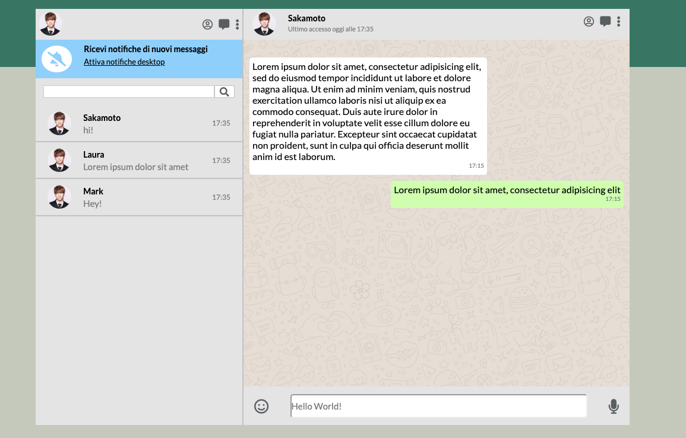
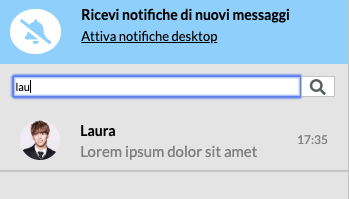
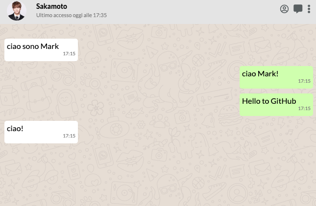

# boolzapp

<h1> Clone of Whatsapp Web</h1>
<h2>Goal:</h2>

Build a clone of Whatsapp web using <b>JQuery - HTML - CSS</b>

<h2>Usability</h2>

The user can see all the current multiple conversations and click to read the details. 
 
Also, the user can search conversations using the searchbar, that provides results based on conversation's contact sender/receiver
<h2> Auto-message</h2>
Send a custom message and you will receive an auto-message from the fake user
<h2>Layout</h2>
Layout cloned from Whatsapp Web

</h>

</h>

</h>

